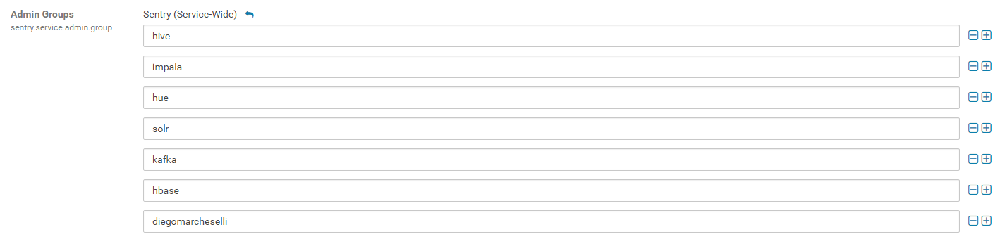

## Configure Sentry to recognize this account as an administrator



## Verify user privileges

```
beeline>  !connect jdbc:hive2://ip-172-32-1-137:10000/default;principal=hive/ip-172-32-1-137@ARDA.COM;
scan complete in 1ms
Connecting to jdbc:hive2://ip-172-32-1-137:10000/default;principal=hive/ip-172-32-1-137@ARDA.COM;
Connected to: Apache Hive (version 1.1.0-cdh5.15.2)
Driver: Hive JDBC (version 1.1.0-cdh5.15.2)
Transaction isolation: TRANSACTION_REPEATABLE_READ
0: jdbc:hive2://ip-172-32-1-137:10000/default> show tables;
INFO  : Compiling command(queryId=hive_20190214094040_e4693c99-815e-4efe-ae83-c861deac1b3f): show tables
INFO  : Semantic Analysis Completed
INFO  : Returning Hive schema: Schema(fieldSchemas:[FieldSchema(name:tab_name, type:string, comment:from deserializer)], properties:null)
INFO  : Completed compiling command(queryId=hive_20190214094040_e4693c99-815e-4efe-ae83-c861deac1b3f); Time taken: 0.454 seconds
INFO  : Executing command(queryId=hive_20190214094040_e4693c99-815e-4efe-ae83-c861deac1b3f): show tables
INFO  : Starting task [Stage-0:DDL] in serial mode
INFO  : Completed executing command(queryId=hive_20190214094040_e4693c99-815e-4efe-ae83-c861deac1b3f); Time taken: 0.054 seconds
INFO  : OK
+-----------+--+
| tab_name  |
+-----------+--+
+-----------+--+
No rows selected (1.759 seconds)
0: jdbc:hive2://ip-172-32-1-137:10000/default>
```


## Create test roles

```
[ec2-user@ip-172-32-1-224 ~]$ sudo su
[root@ip-172-32-1-224 ec2-user]# sudo groupadd selector
[root@ip-172-32-1-224 ec2-user]# sudo groupadd inserters
[root@ip-172-32-1-224 ec2-user]# sudo useradd -u 1100 -g selector george
[root@ip-172-32-1-224 ec2-user]# sudo useradd -u 1200 -g inserters ferdinand

[ec2-user@ip-172-32-1-224 ~]$ ansible all -a "sudo groupadd selector
> "
 [WARNING]: Consider using 'become', 'become_method', and 'become_user' rather than running sudo

172.32.1.206 | CHANGED | rc=0 >>


172.32.1.224 | FAILED | rc=9 >>
groupadd: group 'selector' already existsnon-zero return code

172.32.1.56 | CHANGED | rc=0 >>


172.32.1.38 | CHANGED | rc=0 >>


172.32.1.137 | CHANGED | rc=0 >>


[ec2-user@ip-172-32-1-224 ~]$ ansible all -a "sudo groupadd inserters"
 [WARNING]: Consider using 'become', 'become_method', and 'become_user' rather than running sudo

172.32.1.224 | FAILED | rc=9 >>
groupadd: group 'inserters' already existsnon-zero return code

172.32.1.206 | CHANGED | rc=0 >>


172.32.1.56 | CHANGED | rc=0 >>


172.32.1.38 | CHANGED | rc=0 >>


172.32.1.137 | CHANGED | rc=0 >>


[ec2-user@ip-172-32-1-224 ~]$ ansible all -a "sudo useradd -u 1100 -g selector george"
 [WARNING]: Consider using 'become', 'become_method', and 'become_user' rather than running sudo

172.32.1.206 | CHANGED | rc=0 >>


172.32.1.224 | FAILED | rc=9 >>
useradd: user 'george' already existsnon-zero return code

172.32.1.38 | CHANGED | rc=0 >>


172.32.1.137 | CHANGED | rc=0 >>


172.32.1.56 | CHANGED | rc=0 >>


[ec2-user@ip-172-32-1-224 ~]$ ansible all -a "sudo useradd -u 1200 -g inserters ferdinand"
 [WARNING]: Consider using 'become', 'become_method', and 'become_user' rather than running sudo

172.32.1.206 | CHANGED | rc=0 >>


172.32.1.137 | CHANGED | rc=0 >>


172.32.1.224 | FAILED | rc=9 >>
useradd: user 'ferdinand' already existsnon-zero return code

172.32.1.56 | CHANGED | rc=0 >>


172.32.1.38 | CHANGED | rc=0 >>


[root@ip-172-32-1-224 ec2-user]# kadmin.local: add_principal george
bash: kadmin.local:: command not found
[root@ip-172-32-1-224 ec2-user]# kadmin.local
Authenticating as principal cloudera-scm/admin@ARDA.COM with password.
kadmin.local:  add_principal george
WARNING: no policy specified for george@ARDA.COM; defaulting to no policy
Enter password for principal "george@ARDA.COM":
Re-enter password for principal "george@ARDA.COM":
Principal "george@ARDA.COM" created.
kadmin.local:  add_principal ferdinand
WARNING: no policy specified for ferdinand@ARDA.COM; defaulting to no policy
Enter password for principal "ferdinand@ARDA.COM":
Re-enter password for principal "ferdinand@ARDA.COM":
Principal "ferdinand@ARDA.COM" created.
kadmin.local:  xit
kadmin.local: Unknown request "xit".  Type "?" for a request list.
kadmin.local:  exit
```


## Create test roles

```
0: jdbc:hive2://ip-172-32-1-137:10000/default> CREATE ROLE reads;
INFO  : Compiling command(queryId=hive_20190214104949_65423fba-b6e7-48e4-a5aa-4f0657f8ea6b): CREATE ROLE reads
INFO  : Semantic Analysis Completed
INFO  : Returning Hive schema: Schema(fieldSchemas:null, properties:null)
INFO  : Completed compiling command(queryId=hive_20190214104949_65423fba-b6e7-48e4-a5aa-4f0657f8ea6b); Time taken: 0.065 seconds
INFO  : Executing command(queryId=hive_20190214104949_65423fba-b6e7-48e4-a5aa-4f0657f8ea6b): CREATE ROLE reads
INFO  : Starting task [Stage-0:DDL] in serial mode
INFO  : Completed executing command(queryId=hive_20190214104949_65423fba-b6e7-48e4-a5aa-4f0657f8ea6b); Time taken: 0.021 seconds
INFO  : OK
No rows affected (0.095 seconds)
0: jdbc:hive2://ip-172-32-1-137:10000/default> CREATE ROLE writes;
INFO  : Compiling command(queryId=hive_20190214104949_df298ee6-3047-49b2-b6d7-47e721a311d6): CREATE ROLE writes
INFO  : Semantic Analysis Completed
INFO  : Returning Hive schema: Schema(fieldSchemas:null, properties:null)
INFO  : Completed compiling command(queryId=hive_20190214104949_df298ee6-3047-49b2-b6d7-47e721a311d6); Time taken: 0.049 seconds
INFO  : Executing command(queryId=hive_20190214104949_df298ee6-3047-49b2-b6d7-47e721a311d6): CREATE ROLE writes
INFO  : Starting task [Stage-0:DDL] in serial mode
INFO  : Completed executing command(queryId=hive_20190214104949_df298ee6-3047-49b2-b6d7-47e721a311d6); Time taken: 0.008 seconds
INFO  : OK
No rows affected (0.067 seconds)
```

## Grant read privilege for all tables to reads


```
0: jdbc:hive2://ip-172-32-1-137:10000/default> GRANT SELECT ON DATABASE default TO ROLE reads;
INFO  : Compiling command(queryId=hive_20190214104949_084f54c4-ff98-4d28-8eae-46eb258cd45a): GRANT SELECT ON DATABASE default TO ROLE reads
INFO  : Semantic Analysis Completed
INFO  : Returning Hive schema: Schema(fieldSchemas:null, properties:null)
INFO  : Completed compiling command(queryId=hive_20190214104949_084f54c4-ff98-4d28-8eae-46eb258cd45a); Time taken: 0.057 seconds
INFO  : Executing command(queryId=hive_20190214104949_084f54c4-ff98-4d28-8eae-46eb258cd45a): GRANT SELECT ON DATABASE default TO ROLE reads
INFO  : Starting task [Stage-0:DDL] in serial mode
INFO  : Completed executing command(queryId=hive_20190214104949_084f54c4-ff98-4d28-8eae-46eb258cd45a); Time taken: 0.014 seconds
INFO  : OK
No rows affected (0.08 seconds)
0: jdbc:hive2://ip-172-32-1-137:10000/default> GRANT ROLE reads TO GROUP selector;
INFO  : Compiling command(queryId=hive_20190214104949_5e6aa2df-1898-4aa7-8655-29d6c69c68d2): GRANT ROLE reads TO GROUP selector
INFO  : Semantic Analysis Completed
INFO  : Returning Hive schema: Schema(fieldSchemas:null, properties:null)
INFO  : Completed compiling command(queryId=hive_20190214104949_5e6aa2df-1898-4aa7-8655-29d6c69c68d2); Time taken: 0.049 seconds
INFO  : Executing command(queryId=hive_20190214104949_5e6aa2df-1898-4aa7-8655-29d6c69c68d2): GRANT ROLE reads TO GROUP selector
INFO  : Starting task [Stage-0:DDL] in serial mode
INFO  : Completed executing command(queryId=hive_20190214104949_5e6aa2df-1898-4aa7-8655-29d6c69c68d2); Time taken: 0.011 seconds
INFO  : OK
No rows affected (0.07 seconds)
```


## Grant read privilege for all tables to reads


```
0: jdbc:hive2://ip-172-32-1-137:10000/default> REVOKE ALL ON DATABASE default FROM ROLE writes;
INFO  : Compiling command(queryId=hive_20190214105050_3f0232b8-95a4-4ac5-9b88-afb597b5dc72): REVOKE ALL ON DATABASE default FROM ROLE writes
INFO  : Semantic Analysis Completed
INFO  : Returning Hive schema: Schema(fieldSchemas:null, properties:null)
INFO  : Completed compiling command(queryId=hive_20190214105050_3f0232b8-95a4-4ac5-9b88-afb597b5dc72); Time taken: 0.053 seconds
INFO  : Executing command(queryId=hive_20190214105050_3f0232b8-95a4-4ac5-9b88-afb597b5dc72): REVOKE ALL ON DATABASE default FROM ROLE writes
INFO  : Starting task [Stage-0:DDL] in serial mode
INFO  : Completed executing command(queryId=hive_20190214105050_3f0232b8-95a4-4ac5-9b88-afb597b5dc72); Time taken: 0.037 seconds
INFO  : OK
No rows affected (0.098 seconds)
0: jdbc:hive2://ip-172-32-1-137:10000/default> GRANT INSERT ON default.sample_07 TO ROLE writes;
INFO  : Compiling command(queryId=hive_20190214105151_d42ceaa4-bd39-4083-97e1-8fb9cb6fb9e8): GRANT INSERT ON default.sample_07 TO ROLE writes
INFO  : Semantic Analysis Completed
INFO  : Returning Hive schema: Schema(fieldSchemas:null, properties:null)
INFO  : Completed compiling command(queryId=hive_20190214105151_d42ceaa4-bd39-4083-97e1-8fb9cb6fb9e8); Time taken: 0.059 seconds
INFO  : Executing command(queryId=hive_20190214105151_d42ceaa4-bd39-4083-97e1-8fb9cb6fb9e8): GRANT INSERT ON default.sample_07 TO ROLE writes
INFO  : Starting task [Stage-0:DDL] in serial mode
INFO  : Completed executing command(queryId=hive_20190214105151_d42ceaa4-bd39-4083-97e1-8fb9cb6fb9e8); Time taken: 0.01 seconds
INFO  : OK
No rows affected (0.078 seconds)
0: jdbc:hive2://ip-172-32-1-137:10000/default> GRANT ROLE writes TO GROUP inserters;
INFO  : Compiling command(queryId=hive_20190214105151_3e1ee0f8-f89a-4d1f-90c1-772960e87e63): GRANT ROLE writes TO GROUP inserters
INFO  : Semantic Analysis Completed
INFO  : Returning Hive schema: Schema(fieldSchemas:null, properties:null)
INFO  : Completed compiling command(queryId=hive_20190214105151_3e1ee0f8-f89a-4d1f-90c1-772960e87e63); Time taken: 0.049 seconds
INFO  : Executing command(queryId=hive_20190214105151_3e1ee0f8-f89a-4d1f-90c1-772960e87e63): GRANT ROLE writes TO GROUP inserters
INFO  : Starting task [Stage-0:DDL] in serial mode
INFO  : Completed executing command(queryId=hive_20190214105151_3e1ee0f8-f89a-4d1f-90c1-772960e87e63); Time taken: 0.012 seconds
INFO  : OK
No rows affected (0.069 seconds)
```

## kinit as george, then login to beeline


```
[ec2-user@ip-172-32-1-137 ~]$ kinit george
Password for george@ARDA.COM:
[ec2-user@ip-172-32-1-137 ~]$ beeline
Beeline version 1.1.0-cdh5.15.2 by Apache Hive
beeline>  !connect jdbc:hive2://ip-172-32-1-137:10000/default;principal=hive/ip-172-32-1-137@ARDA.COM;
scan complete in 2ms
Connecting to jdbc:hive2://ip-172-32-1-137:10000/default;principal=hive/ip-172-32-1-137@ARDA.COM;
Connected to: Apache Hive (version 1.1.0-cdh5.15.2)
Driver: Hive JDBC (version 1.1.0-cdh5.15.2)
Transaction isolation: TRANSACTION_REPEATABLE_READ
0: jdbc:hive2://ip-172-32-1-137:10000/default> show tables;
INFO  : Compiling command(queryId=hive_20190214121616_86513584-ddb3-4134-8f9a-3a2521893358): show tables
INFO  : Semantic Analysis Completed
INFO  : Returning Hive schema: Schema(fieldSchemas:[FieldSchema(name:tab_name, type:string, comment:from deserializer)], properties:null)
INFO  : Completed compiling command(queryId=hive_20190214121616_86513584-ddb3-4134-8f9a-3a2521893358); Time taken: 0.057 seconds
INFO  : Executing command(queryId=hive_20190214121616_86513584-ddb3-4134-8f9a-3a2521893358): show tables
INFO  : Starting task [Stage-0:DDL] in serial mode
INFO  : Completed executing command(queryId=hive_20190214121616_86513584-ddb3-4134-8f9a-3a2521893358); Time taken: 0.088 seconds
INFO  : OK
+------------+--+
|  tab_name  |
+------------+--+
| employee   |
| sample_07  |
+------------+--+
2 rows selected (0.211 seconds)
0: jdbc:hive2://ip-172-32-1-137:10000/default>

```


## kinit as erdonand, then login to beeline


```[ec2-user@ip-172-32-1-137 ~]$ kinit ferdinand
Password for ferdinand@ARDA.COM:
[ec2-user@ip-172-32-1-137 ~]$ beeline
Beeline version 1.1.0-cdh5.15.2 by Apache Hive
beeline>  !connect jdbc:hive2://ip-172-32-1-137:10000/default;principal=hive/ip-172-32-1-137@ARDA.COM;
scan complete in 1ms
Connecting to jdbc:hive2://ip-172-32-1-137:10000/default;principal=hive/ip-172-32-1-137@ARDA.COM;
Connected to: Apache Hive (version 1.1.0-cdh5.15.2)
Driver: Hive JDBC (version 1.1.0-cdh5.15.2)
Transaction isolation: TRANSACTION_REPEATABLE_READ
0: jdbc:hive2://ip-172-32-1-137:10000/default> show tables;
INFO  : Compiling command(queryId=hive_20190214115656_5b60611c-b675-435b-aabb-d1182984ae0c): show tables
INFO  : Semantic Analysis Completed
INFO  : Returning Hive schema: Schema(fieldSchemas:[FieldSchema(name:tab_name, type:string, comment:from deserializer)], properties:null)
INFO  : Completed compiling command(queryId=hive_20190214115656_5b60611c-b675-435b-aabb-d1182984ae0c); Time taken: 0.057 seconds
INFO  : Executing command(queryId=hive_20190214115656_5b60611c-b675-435b-aabb-d1182984ae0c): show tables
INFO  : Starting task [Stage-0:DDL] in serial mode
INFO  : Completed executing command(queryId=hive_20190214115656_5b60611c-b675-435b-aabb-d1182984ae0c); Time taken: 0.101 seconds
INFO  : OK
+------------+--+
|  tab_name  |
+------------+--+
| sample_07  |
+------------+--+
1 row selected (0.229 seconds)

```


