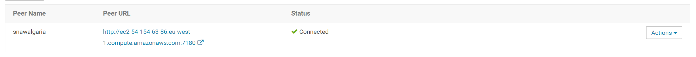
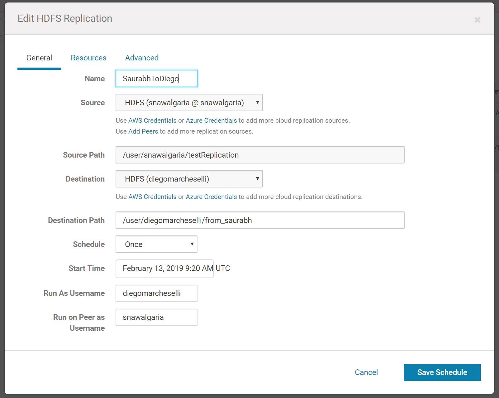
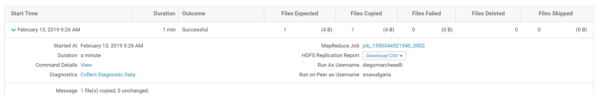
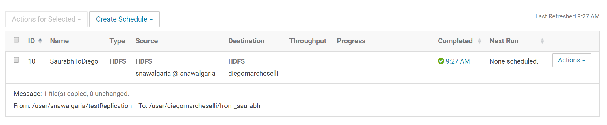

## Replicate to another cluster


###  Use teragen to create a 500 MB file


``` 
hadoop jar /opt/cloudera/parcels/CDH/lib/hadoop-0.20-mapreduce/hadoop-examples.jar\
	 teragen 5000000\
	 /user/diegomarcheselli/teragen-distcp
```

``` 
19/02/12 21:28:11 INFO client.RMProxy: Connecting to ResourceManager at ip-172-32-1-137/172.32.1.137:8032
19/02/12 21:28:11 INFO terasort.TeraGen: Generating 5000000 using 2
19/02/12 21:28:11 INFO mapreduce.JobSubmitter: number of splits:2
19/02/12 21:28:12 INFO mapreduce.JobSubmitter: Submitting tokens for job: job_1549980239113_0011
19/02/12 21:28:12 INFO impl.YarnClientImpl: Submitted application application_1549980239113_0011
19/02/12 21:28:12 INFO mapreduce.Job: The url to track the job: http://ip-172-32-1-137:8088/proxy/application_1549980239113_0011/
19/02/12 21:28:12 INFO mapreduce.Job: Running job: job_1549980239113_0011
19/02/12 21:28:17 INFO mapreduce.Job: Job job_1549980239113_0011 running in uber mode : false
19/02/12 21:28:17 INFO mapreduce.Job:  map 0% reduce 0%
19/02/12 21:28:25 INFO mapreduce.Job:  map 100% reduce 0%
19/02/12 21:28:25 INFO mapreduce.Job: Job job_1549980239113_0011 completed successfully
19/02/12 21:28:25 INFO mapreduce.Job: Counters: 31
        File System Counters
                FILE: Number of bytes read=0
                FILE: Number of bytes written=298192
                FILE: Number of read operations=0
                FILE: Number of large read operations=0
                FILE: Number of write operations=0
                HDFS: Number of bytes read=167
                HDFS: Number of bytes written=500000000
                HDFS: Number of read operations=8
                HDFS: Number of large read operations=0
                HDFS: Number of write operations=4
        Job Counters
                Launched map tasks=2
                Other local map tasks=2
                Total time spent by all maps in occupied slots (ms)=12874
                Total time spent by all reduces in occupied slots (ms)=0
                Total time spent by all map tasks (ms)=12874
                Total vcore-milliseconds taken by all map tasks=12874
                Total megabyte-milliseconds taken by all map tasks=13182976
        Map-Reduce Framework
                Map input records=5000000
                Map output records=5000000
                Input split bytes=167
                Spilled Records=0
                Failed Shuffles=0
                Merged Map outputs=0
                GC time elapsed (ms)=242
                CPU time spent (ms)=9960
                Physical memory (bytes) snapshot=758202368
                Virtual memory (bytes) snapshot=3163979776
                Total committed heap usage (bytes)=882376704
        org.apache.hadoop.examples.terasort.TeraGen$Counters
                CHECKSUM=10735710707299981
        File Input Format Counters
                Bytes Read=0
        File Output Format Counters
                Bytes Written=500000000

```


### Copy your partner's file to your target directory

at the moment I cant change the permissions of my partner folder I  created a new user in my partner cluster

``` 
hadoop distcp \
	hdfs://ec2-34-255-86-99.eu-west-1.compute.amazonaws.com:8020/user/diegomarcheselli/teragen-distcp \
	hdfs://ec2-34-247-13-48.eu-west-1.compute.amazonaws.com:8020/user/johnnsmith/teragen-distcp

```


``` 
19/02/12 21:43:22 INFO tools.OptionsParser: parseChunkSize: blocksperchunk false
19/02/12 21:43:23 INFO tools.DistCp: Input Options: DistCpOptions{atomicCommit=false, syncFolder=false, deleteMissing=false, ignoreFailures=false, overwrite=false, append=false, useDiff=false, useRdiff=false, fromSnapshot=null, toSnapshot=null, skipCRC=false, blocking=true, numListstatusThreads=0, maxMaps=20, mapBandwidth=100, sslConfigurationFile='null', copyStrategy='uniformsize', preserveStatus=[], preserveRawXattrs=false, atomicWorkPath=null, logPath=null, sourceFileListing=null, sourcePaths=[hdfs://ec2-34-255-86-99.eu-west-1.compute.amazonaws.com:8020/user/diegomarcheselli/teragen-distcp], targetPath=hdfs://ec2-34-247-13-48.eu-west-1.compute.amazonaws.com:8020/user/johnnsmith/teragen-distcp, targetPathExists=false, filtersFile='null', blocksPerChunk=0, copyBufferSize=8192}
19/02/12 21:43:23 INFO client.RMProxy: Connecting to ResourceManager at ip-172-32-1-137/172.32.1.137:8032
19/02/12 21:43:24 INFO tools.SimpleCopyListing: Paths (files+dirs) cnt = 4; dirCnt = 1
19/02/12 21:43:24 INFO tools.SimpleCopyListing: Build file listing completed.
19/02/12 21:43:24 INFO Configuration.deprecation: io.sort.mb is deprecated. Instead, use mapreduce.task.io.sort.mb
19/02/12 21:43:24 INFO Configuration.deprecation: io.sort.factor is deprecated. Instead, use mapreduce.task.io.sort.factor
19/02/12 21:43:24 INFO tools.DistCp: Number of paths in the copy list: 4
19/02/12 21:43:24 INFO tools.DistCp: Number of paths in the copy list: 4
19/02/12 21:43:24 INFO client.RMProxy: Connecting to ResourceManager at ip-172-32-1-137/172.32.1.137:8032
19/02/12 21:43:24 INFO mapreduce.JobSubmitter: number of splits:3
19/02/12 21:43:24 INFO mapreduce.JobSubmitter: Submitting tokens for job: job_1549980239113_0014
19/02/12 21:43:24 INFO impl.YarnClientImpl: Submitted application application_1549980239113_0014
19/02/12 21:43:24 INFO mapreduce.Job: The url to track the job: http://ip-172-32-1-137:8088/proxy/application_1549980239113_0014/
19/02/12 21:43:24 INFO tools.DistCp: DistCp job-id: job_1549980239113_0014
19/02/12 21:43:24 INFO mapreduce.Job: Running job: job_1549980239113_0014
19/02/12 21:43:30 INFO mapreduce.Job: Job job_1549980239113_0014 running in uber mode : false
19/02/12 21:43:30 INFO mapreduce.Job:  map 0% reduce 0%
19/02/12 21:43:37 INFO mapreduce.Job:  map 33% reduce 0%
19/02/12 21:43:39 INFO mapreduce.Job:  map 100% reduce 0%
19/02/12 21:43:39 INFO mapreduce.Job: Job job_1549980239113_0014 completed successfully
19/02/12 21:43:39 INFO mapreduce.Job: Counters: 33
        File System Counters
                FILE: Number of bytes read=0
                FILE: Number of bytes written=457851
                FILE: Number of read operations=0
                FILE: Number of large read operations=0
                FILE: Number of write operations=0
                HDFS: Number of bytes read=500002104
                HDFS: Number of bytes written=500000000
                HDFS: Number of read operations=50
                HDFS: Number of large read operations=0
                HDFS: Number of write operations=13
        Job Counters
                Launched map tasks=3
                Other local map tasks=3
                Total time spent by all maps in occupied slots (ms)=16418
                Total time spent by all reduces in occupied slots (ms)=0
                Total time spent by all map tasks (ms)=16418
                Total vcore-milliseconds taken by all map tasks=16418
                Total megabyte-milliseconds taken by all map tasks=16812032
        Map-Reduce Framework
                Map input records=4
                Map output records=0
                Input split bytes=342
                Spilled Records=0
                Failed Shuffles=0
                Merged Map outputs=0
                GC time elapsed (ms)=144
                CPU time spent (ms)=6790
                Physical memory (bytes) snapshot=855195648
                Virtual memory (bytes) snapshot=4759711744
                Total committed heap usage (bytes)=1174405120
        File Input Format Counters
                Bytes Read=1762
        File Output Format Counters
                Bytes Written=0
        DistCp Counters
                Bytes Copied=500000000
                Bytes Expected=500000000
                Files Copied=4
```


### Create Peer




### Create Schedule




### Run Scheduler






## File received


